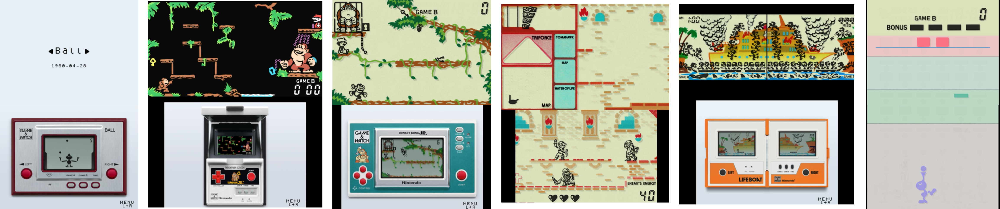

# Yokoi - Game & Watch Emulator for 3DS
A Game & Watch emulator for 3DS: SM5A, SM510, and SM511/SM512.

# Build Instructions
The code has been tested and compiled on Windows. The conversion scripts may not work on Linux or Mac due to the reliance on Inkscape.  
The source code is provided **without the ROMs or graphics of the original Game & Watch devices** (copyrighted).  

To convert the ROMs, use the provided Python program included in the `CONVERT_ROM` folder. The ROMs used are the same as those that work with MAME.  
ROM parameters should be specified in the `games_path` dictionary. A pre-filled version is included in the source code.  
There is no strict ROM size limit—you can define one or use existing sizes.  

The conversion code requires **Inkscape**, as MAME ROMs use the SVG vector format (not directly readable on the 3DS). Inkscape is used to convert these vector graphics into PNG images.

## 3DS build: embedded vs external pack

This project supports two 3DS build modes:

- **Embedded (default):** ROMs and textures are built into the `.3dsx/.cia` (via generated `source/std/GW_ROM/*` and `romfs/gfx/*.t3x`).
- **External pack (pack-only):** the app ships without embedded ROMs/textures and loads everything from `sdmc:/3ds/yokoi_pack_3ds.ykp`.

### Build (embedded, default)

1. Generate assets + sources:
	- `python CONVERT_ROM/convert_original.py --target 3ds`
	- `python CONVERT_ROM/convert_3ds.py --target 3ds`
2. Build:
	- `make`

### Build (external pack, no embedded ROMs/textures)

1. Generate the pack file:
	- `python CONVERT_ROM/convert_3ds.py --target 3ds`
2. Build the 3DS app in pack-only mode:
	- `make clean`
	- `make ROMPACK_ONLY=1`
3. Copy the pack to the SD card:
	- `sdmc:/3ds/yokoi_pack_3ds.ykp`

## Android build (embedded vs external pack)

The Android project lives in the `android/` folder and provides two build variants:

- **embedded** (default): includes `gfx2x` as APK assets and can still load a pack if you place one in app storage.
- **rompackOnly**: does not include embedded ROMs/assets; requires `yokoi_pack_rgds.ykp` at runtime.

Android ROM pack location:

- The app will try to load `yokoi_pack_rgds.ykp` and if missing show a message where you can select the ykp rom pack file to import and use.

- Copy `yokoi_pack_rgds.ykp` anywhere you can access easily (e.g. `Download/`).
- Launch the app; if the ROM pack is missing/outdated, an import screen appears. 
- Tap **Import/Update ROM pack** and select the file. The app copies it into private storage and loads it.
- Rom pack is then imported.

### Android Studio

- Open the `android/` folder in Android Studio.
- Use **Build Variants** to pick `embeddedDebug` or `rompackOnlyDebug`.

# Known issues
- Very imperfect sound / strange resonance on Game & Watch SM510 (e.g., Donkey Kong JR Widescreen)
- Bug on some Game & Watch SM5A (sometimes freezes at the end of a game)

# License
Public Domain / Free to use  
No attribution required :)

# Credits
Code inspired by MAME, Game & Watch FPGA projects (Adam Gastineau), and official Sharp documentation.  
ROMs and artwork are based on MAME ROMs.  
Thanks to everyone who contributed to MAME, Adam Gastineau, and all those who worked on Game & Watch ROMs and artwork!
